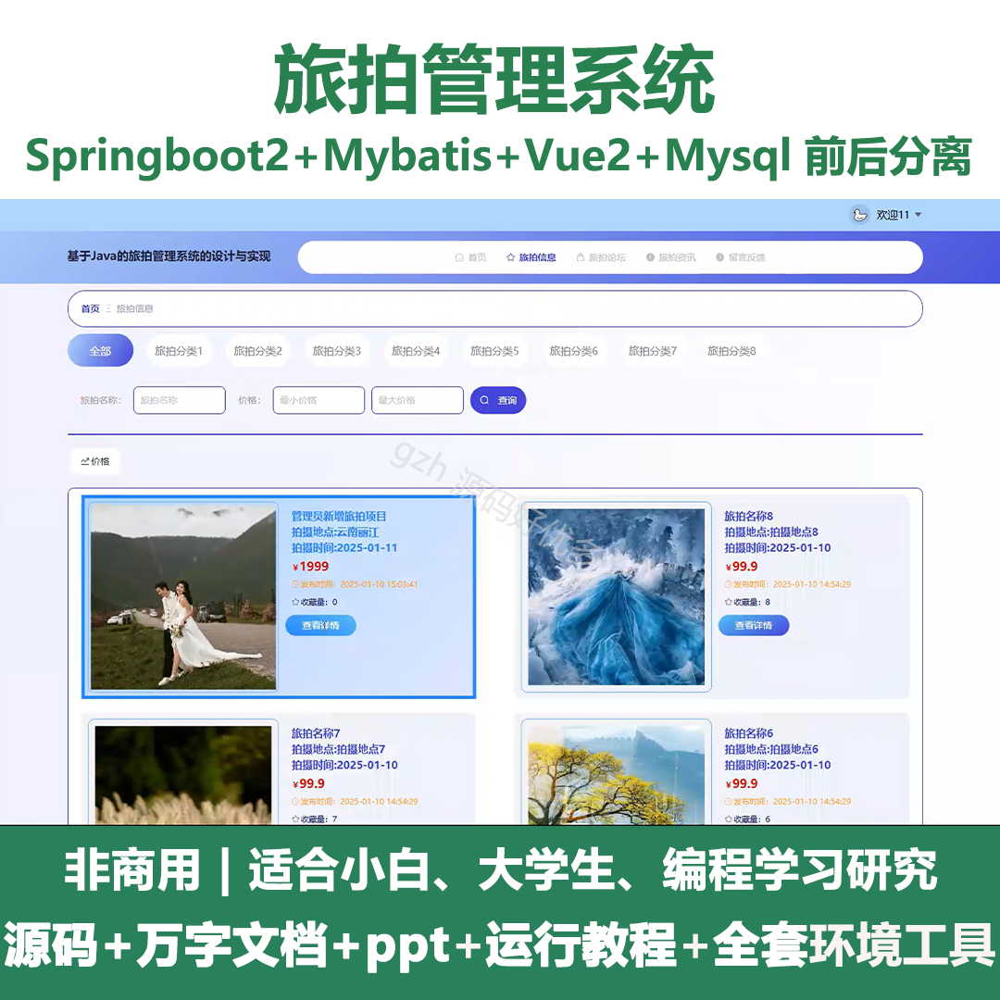
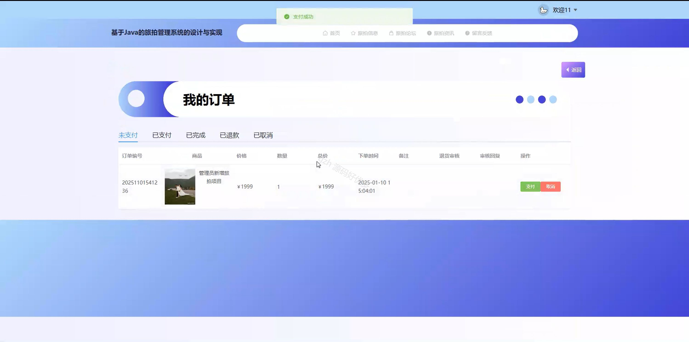
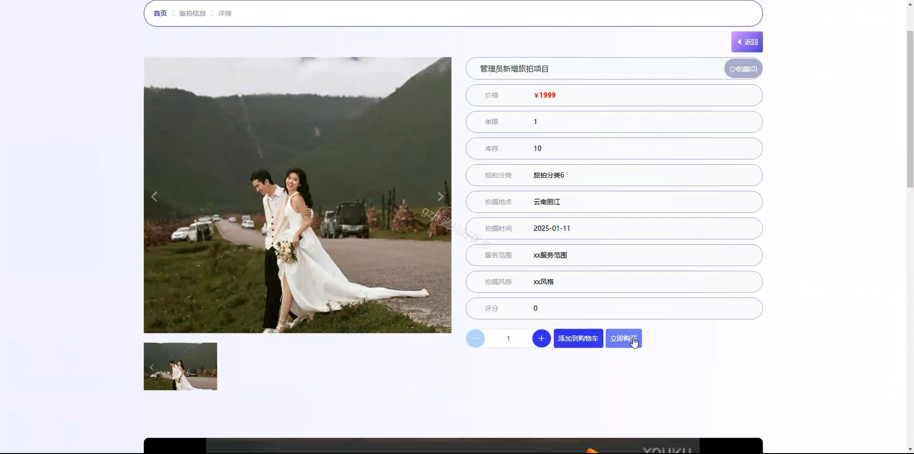
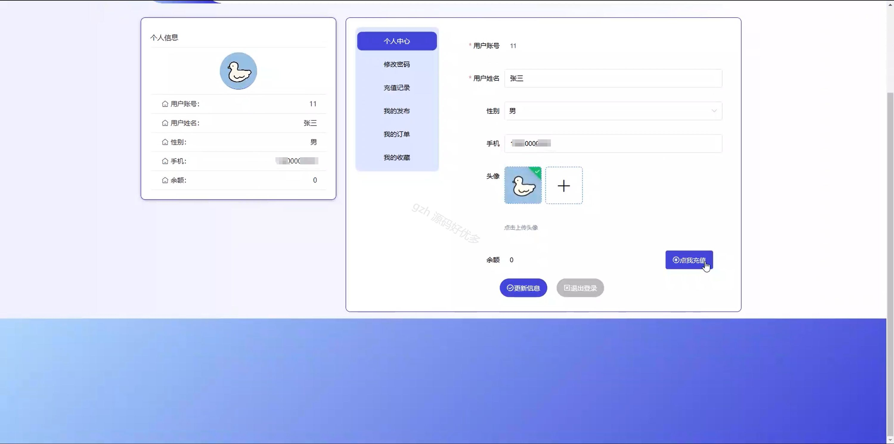
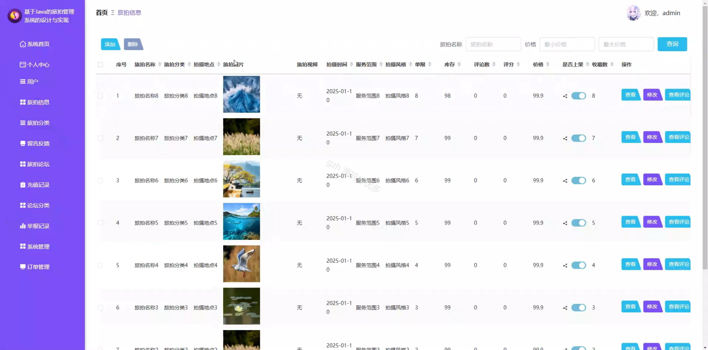
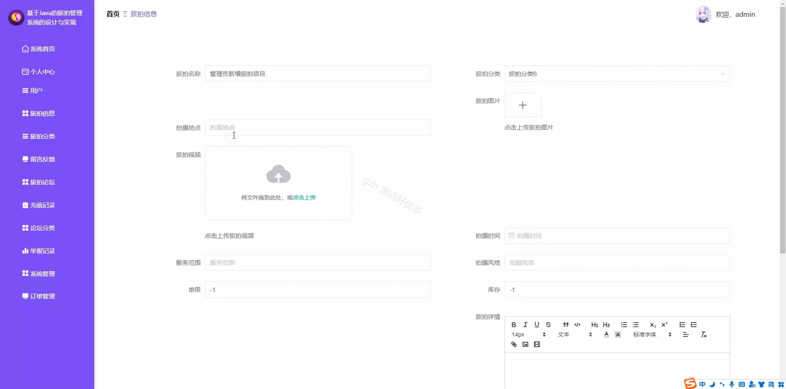
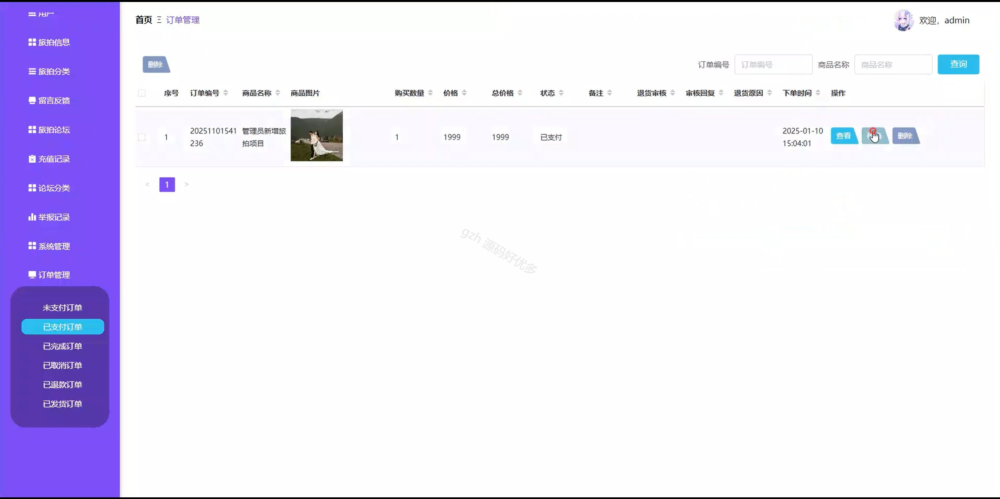
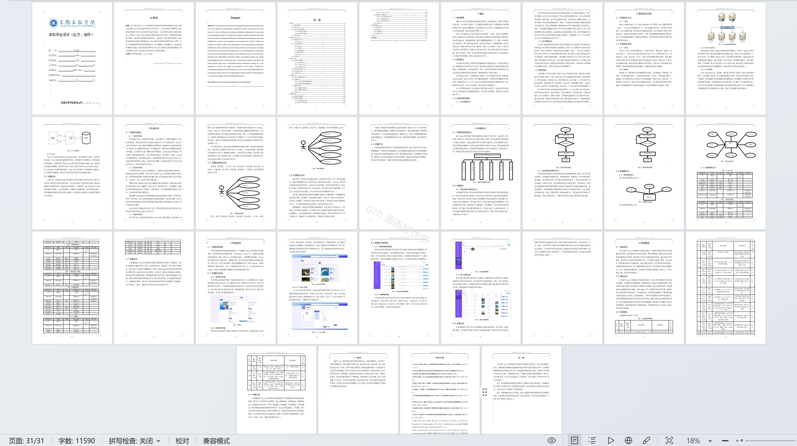

# springbootA292D
springbootA292D旅拍管理系统+LW
 
## 查看主页获取源码

### 一、关键词
旅拍信息、旅拍论坛、旅拍资讯

### 二、作品包含
源码+数据库+设计文档万字+ppt+全套环境和工具资源+本地部署教程

### 三、项目技术
前端技术：Html、Css、Js、Vue2.0、Element-ui 
后端技术：Java、SpringBoot2.0、MyBatis

### 四、运行环境（以下版本亲测，其他版本未知，请自测）
开发工具：IDEA/eclipse  + VSCODE

数据库：MySQL5.7（最低要5.7版本）

数据库管理工具：Navicat10以上版本

环境配置软件： JDK1.8 + Maven3.6.3

前端Nodejs：14

浏览器：谷歌浏览器

### 五、项目介绍
项目编号：springbootA292D

旅拍管理系统可满足用户浏览旅拍信息等需求，实现旅拍相关业务的高效运转。

角色：管理员、用户

用户功能：首页、旅拍信息、旅拍论坛、旅拍资讯、留言反馈、个人中心、修改密码、充值记录、我的发布、我的订单、我的收藏。

管理员功能：系统首页、个人中心、用户、旅拍信息、旅拍分类、留言反馈、旅拍论坛、充值记录、论坛分类、举报记录、系统管理、订单管理。

### 六、运行截图

